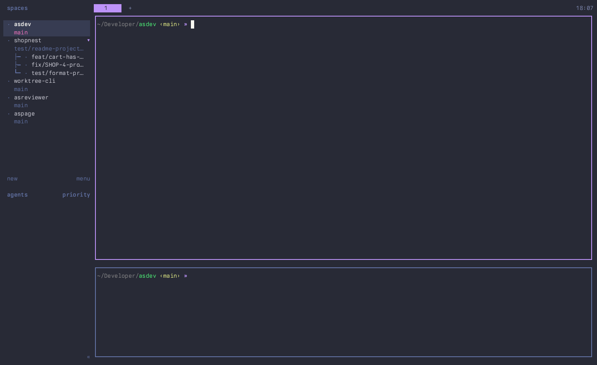

# gotopr

A [herdr](https://github.com/asumaran/herdr) plugin popup that lists your open
GitHub PRs (author or assignee) across the repos cloned under `~/Developer`,
grouped by repo, with fuzzy search and a preview of each PR: labels, CI
checks, review state, diff size and the rendered markdown description.
Selecting a PR lands you on its checkout:

- an existing worktree for the PR's branch is opened/focused in the herdr
  sidebar (added when missing);
- otherwise the main clone switches to the branch — offering to stash first
  when the tree is dirty — and the repo is selected in the sidebar (added when
  missing).



Sibling of [herdr-goto](https://github.com/asumaran/herdr-goto): same
open-pick-exit popup pattern, same fuzzy search feel, but the universe is
your PRs on GitHub instead of the workspaces already in herdr.

## Install

```
herdr plugin install asumaran/gotopr
```

The manifest's `[[build]]` runs `scripts/fetch-binary.sh`, which downloads the
release binary matching the manifest version and falls back to `go build`
(`GOTOPR_BUILD_FROM_SOURCE=1` skips the download). Requires herdr >= 0.7.5 and
the [`gh` CLI](https://cli.github.com) authenticated (`gh auth login`).

Bind a key to the `open` action in `~/.config/herdr/config.toml`:

```toml
[[keys.command]]
key = ["prefix+d", "ctrl+alt+d"]
type = "plugin_action"
command = "asumaran.gotopr.open"
description = "gotopr (PR switcher)"
```

## Usage

The filter input is focused on open — just type. Search is fuzzy over the PR
title, the head branch, the PR number (`1234` finds `#1234`), the Jira ticket
key in branch/title, and the repo name. `↑/↓` (or `ctrl+p`/`ctrl+n`) move
between PRs, `shift+↓`/`shift+↑` (or PgDn/PgUp) scroll the description
preview, `shift+←`/`shift+→` resize the list (the split is remembered; the
list takes a quarter of the width by default), `enter` opens the selected PR's checkout, `ctrl+o` opens the PR in
the browser instead, `esc` closes (so does `q` while the filter is empty). The mouse
wheel moves the selection over the list and scrolls the description anywhere
else; clicking a PR selects it (enter still opens it).

When the PR's branch needs a checkout switch and the working tree has
uncommitted changes, gotopr offers: `[s]` stash & switch (stash message
`gotopr: switching to <branch>`, findable later with `git stash list`; there
is no auto-restore), `[f]` switch anyway, `[esc]` cancel. Fork PRs and
never-fetched branches are fetched via `pull/<N>/head` before switching.

## Behavior notes

- PR data comes from two GraphQL searches (`author:@me` / `assignee:@me`,
  open PRs only, first 100 each — no pagination) filtered to repos with a
  GitHub `origin` cloned directly under `~/Developer`.
- Everything is cached stale-while-revalidate in the plugin state dir: the
  popup renders instantly from the last snapshot while a background refresh
  runs (skipped entirely when the snapshot is under 60s old). PR bodies are
  only refetched when the PR's `updatedAt` moved, in a single batched query.
- When the same origin is cloned twice, the PR is listed once under the
  clone whose directory name matches the remote repo name; a worktree on the
  PR's branch under any clone wins regardless.
- Worktree detection uses `git worktree list --porcelain`, so it works for
  repos not yet in the herdr sidebar and does not assume `~/wt` conventions.
- Missing/unauthenticated `gh`, network failures and rate limits degrade to
  the cached snapshot with the error on the help line.

## Development

```bash
go build -o gotopr .   # local build (plugin runs ./gotopr from the repo root)
./gotopr -dump         # print repos, PRs and worktree resolution (no TTY)
./gotopr -dump -query cart   # additionally print filter scores for a query
go vet ./... && go test ./...
herdr plugin link ~/Developer/gotopr   # register the working copy (no build step)
```

Runtime state (`prcache.json`, `repos.json`) lives in
`HERDR_PLUGIN_STATE_DIR`; standalone runs fall back to
`~/.config/herdr/gotopr-tui/`. `GOTOPR_ROOT` overrides the `~/Developer` scan
root (used by tests).

## Demo recording

`docs/demo.gif` is recorded with
[herdr-demokit](https://github.com/asumaran/herdr-demokit): `herdr-demo
record` from the repo root replays `scripts/demo/keys.json` against an
isolated herdr session described by `scripts/demo/scenario.sh`. The scenario
points `GOTOPR_ROOT` at a throwaway directory of symlinks to personal repos,
so only those PRs show up; the scan follows symlinked clones for that reason.

## Releasing

`scripts/release.sh <X.Y.Z>` gates on a clean tree + green vet/build/test,
generates the CHANGELOG entry from commit subjects, syncs the manifest
version, commits, tags and publishes the GitHub release; CI then attaches
`gotopr-darwin-arm64`, the asset `fetch-binary.sh` downloads on installs.
